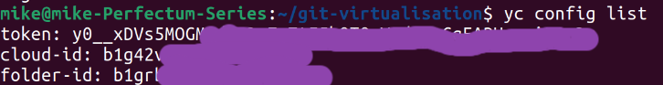

# Домашнее задание к занятию "`Применение принципов IaaC в работе с виртуальными машинами`" - `Белов Михаил`

#### Цели задания

1. Научиться создвать виртуальные машины в Virtualbox с помощью Vagrant.
2. Научиться базовому использованию packer в yandex cloud.

### Задание 1

Установите на личный Linux-компьютер или учебную локальную ВМ с Linux следующие сервисы(желательно ОС ubuntu 20.04):

- [VirtualBox](https://www.virtualbox.org/)


- [Vagrant](https://github.com/netology-code/devops-materials), рекомендуем версию 2.3.4


- [Packer](https://github.com/netology-code/devops-materials/blob/master/README.md) версии 1.9.х + плагин от Яндекс Облако по [инструкции](https://cloud.yandex.ru/docs/tutorials/infrastructure-management/packer-quickstart)
```
mkdir packer && cd packer
export PATH="$PATH:/home/mike/packer"

# Перезапуск оболочки:
exec -l $SHELL

# Проверка версии packer:
packer --version
```


##### Настройка плагина Yandex Compute Builder

Создать файл `config.pkr.hcl` следующего содержания:
```

packer {
  required_plugins {
    yandex = {
      version = ">= 1.1.2"
      source  = "github.com/hashicorp/yandex"
    }
  }
}

```
Установить плагин:
```
packer init config.pkr.hcl
```


- [yandex cloud cli](https://cloud.yandex.com/ru/docs/cli/quickstart) Так же инициализируйте профиль с помощью `yc init`.


---

### Задание 2

1. Убедитесь, что у вас есть ssh ключ в ОС или создайте его с помощью команды `ssh-keygen -t ed25519`
2. Создайте виртуальную машину Virtualbox с помощью Vagrant и [Vagrantfile](./src/Vagrantfile) в директории src.
3. Зайдите внутрь ВМ и убедитесь, что Docker установлен с помощью команды:
```
docker version && docker compose version
```


---

### Задание 3

1. Отредактируйте файл [mydebian.json.pkr.hcl](/src/mydebian.json.pkr.hcl) или mydebian.jsonl в директории src (packer умеет и в json, и в hcl форматы):
- добавьте в скрипт установку docker. Возьмите скрипт установки для debian из [документации](https://docs.docker.com/engine/install/debian/) к docker,
- дополнительно установите в данном образе htop и tmux.(не забудьте про ключ автоматического подтверждения установки для apt)
```
build {
  sources = ["source.yandex.debian_docker"]

  provisioner "shell" {
    inline = ["echo 'Starting provisioning...'"]
  }

  provisioner "shell" {
    inline = [
      # Отключаем проблемный репозиторий bullseye-backports
      "sudo sed -i '/bullseye-backports/d' /etc/apt/sources.list",
      "sudo sed -i '/bullseye-backports/d' /etc/apt/sources.list.d/*.list 2>/dev/null || true",
      
      # Обновление пакетного менеджера (игнорируя ошибки backports)
      "sudo apt-get update -y --allow-releaseinfo-change 2>/dev/null | grep -v 'Failed'",
      
      # Установка зависимостей для apt HTTPS
      "sudo apt-get install -y apt-transport-https ca-certificates curl gnupg lsb-release",
      
      # Добавление GPG-ключа Docker
      "curl -fsSL https://download.docker.com/linux/debian/gpg | sudo gpg --dearmor -o /usr/share/keyrings/docker-archive-keyring.gpg",
      
      # Добавление репозитория Docker
      "echo \"deb [arch=$(dpkg --print-architecture) signed-by=/usr/share/keyrings/docker-archive-keyring.gpg] https://download.docker.com/linux/debian $(lsb_release -cs) stable\" | sudo tee /etc/apt/sources.list.d/docker.list > /dev/null",
      
      # Обновление пакетов после добавления репозитория
      "sudo apt-get update -y",
      
      # Установка Docker Engine
      "sudo apt-get install -y docker-ce docker-ce-cli containerd.io",
      
      # Установка htop и tmux с автоматическим подтверждением
      "sudo DEBIAN_FRONTEND=noninteractive apt-get install -y htop tmux",
      
      # Добавление пользователя debian в группу docker (чтобы не использовать sudo)
      "sudo usermod -aG docker debian",
      
      # Включение автозапуска Docker (опционально)
      "sudo systemctl enable docker",
      
      # Проверка установки
      "docker --version",
      "htop --version",
      "tmux -V"
    ]
  }

  provisioner "shell" {
    inline = ["echo 'Provisioning completed successfully!'"]
  }
}
```
2. Найдите свой образ в web консоли yandex_cloud

3. Необязательное задание(*): найдите в документации yandex cloud как найти свой образ с помощью утилиты командной строки "yc cli".
```
yc compute image list
```
4. Создайте новую ВМ (минимальные параметры) в облаке, используя данный образ.

- При создании машины в web-консоли необходимо указать пользователя `debian` и публичный ssh-ключ локальной (хостовой) машины
5. Подключитесь по ssh и убедитесь в наличии установленного docker.

6. Удалите ВМ и образ.
7. **ВНИМАНИЕ!** Никогда не выкладываете oauth token от облака в git-репозиторий! Утечка секретного токена может привести к финансовым потерям. После выполнения задания обязательно удалите секретные данные из файла mydebian.json и mydebian.json.pkr.hcl. (замените содержимое токена на "ххххх")